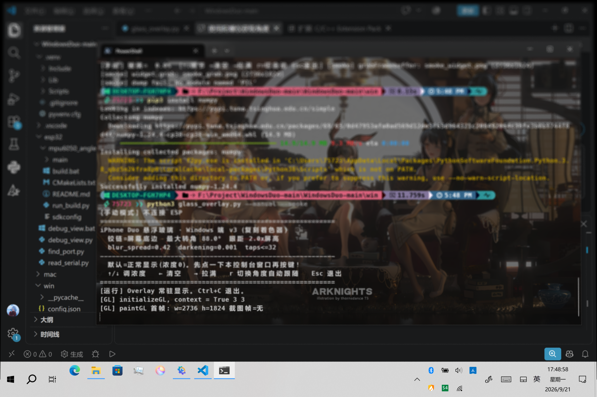

# WindowsDuo

在 Windows / macOS 笔记本上复刻 **iPhone Duo 折叠屏的「悬浮玻璃」效果**：屏幕开合时，桌面内容像隔着一层绕铰链旋转的玻璃——开合角度越大，内容越模糊、越暗，视线出界处渐变为纯黑。



## 效果原理

这不是简单的全屏高斯模糊，而是**空间化的逆投影**：

- 桌面内容固定在世界空间的平面上不动，屏幕则是一块绕底边铰链向观察者旋转的"玻璃"
- 每个像素从眼睛发射线穿过玻璃像素，交到界面平面上得到采样点
- 间隙越大 → 采样半径越大（模糊越强）、衰减越多（越暗）；靠近铰链处始终清晰
- 采样使用 Vogel 螺旋盘 + mip LOD 分级 + 边缘覆盖率平滑，单 pass GLSL 着色器完成

理论模型参考自多个开源复刻（DuoLikeAnimation / iphone-duo / MacDuo / FrostFold），按笔记本场景（铰链 = 屏幕底边）重新实现。

## 三个版本

| 版本 | 平台 | 开合角度来源 | 硬件要求 |
|---|---|---|---|
| **Windows + ESP32** | Windows | 外接 ESP32 + MPU6050 陀螺仪 | 一块 ESP32 开发板 + MPU6050 |
| **macOS Port** | macOS | MacBook 内置盖角传感器 (HID) | 无外接硬件（2016+ 机型） |
| **纯手动** | Windows / macOS | 键盘调节 | 无 |

## 目录结构

```
esp32/                    ESP32 固件 + 串口调试工具 (Windows 版)
  mpu6050_angle/          ESP-IDF 工程: 零漂校准 + 互补滤波, 100Hz 输出角度 JSON
  debug_view.py|.bat      串口实时角度查看器
win/                      Windows 端主程序
  glass_overlay.py        PyQt6 + OpenGL 全屏悬浮层 (角度读取/截屏/着色器)
  config.json             运行参数
  offscreen_test.py       着色器离屏验证
  run_overlay.bat         ESP 驱动启动   /  run_manual.bat  纯键盘启动
mac/                      macOS 版 (详见 mac/README.md)
  glass_overlay_mac.py    主程序: 内置盖角传感器 + OpenGL Core
  lid_sensor.py|.py       HID 传感器读取 / 意图识别状态机
```

## 快速开始

### Windows + ESP32

1. 接线（掌控板 / 通用 ESP32 + MPU6050，I2C）：`P19=SCL→GPIO22`，`P20=SDA→GPIO23`，MPU6050 接该 I2C 总线
2. 烧录固件（需 ESP-IDF v5.x）：
   ```
   python esp32/mpu6050_angle/run_build.py -p COM3 flash
   ```
3. 运行 Windows 端：
   - `win/run_overlay.bat` — ESP 角度驱动（键盘 `r` 切换手动/自动）
   - `win/run_manual.bat` — 纯键盘手动
4. 键盘操作（先点一下控制台窗口获得焦点）：`↑/↓` 浓度 ±3%，`←` 清零，`→` 拉满，`r` 切换控制方，`Esc` 退出

### macOS

```bash
python3 -m venv .venv-mac && source .venv-mac/bin/activate
pip install PyQt6 PyOpenGL numpy Pillow pyobjc-framework-Cocoa pyobjc-framework-Quartz
python mac/glass_overlay_mac.py          # 自动模式
python mac/glass_overlay_mac.py --manual # 手动模式
```

需要"屏幕录制"权限，详见 [mac/README.md](mac/README.md)。

## 主要参数 (`config.json`)

| 参数 | 含义 |
|---|---|
| `angle_closed` / `angle_open` | 角度映射：合盖 / 全开对应的角度（默认 10 / -90） |
| `blur_spread` | 模糊扩散系数（越小越通透） |
| `darkening` | 随间隙变暗的强度 |
| `eye_dist_h` | 视点距离（屏幕高度的倍数） |
| `max_tilt_deg` | 最大倾角 |
| `refresh_hz` | 桌面截图刷新率 |
| `lock_at_close` | 合盖到底自动锁屏（默认关） |

## 已知坑

详见 [AGENTS.md](AGENTS.md)（GL 窗口必须继承 `QOpenGLWidget`、截图反馈污染与自排除、bat 文件禁中文等）。

## License

[MIT](LICENSE)

## Credits

- elijah-semyonov/DuoLikeAnimation — 逆投影模型与 Vogel 盘模糊公式
- chuspeeism/iphone-duo — mip LOD 分级采样与边缘覆盖率平滑
- DhananjayBhosale/MacDuo — 笔记本场景（铰链=屏幕底边，盖角度驱动）
- askmaddyy/FrostFold — 磨砂玻璃观感参数
- macOS 端传感器协议参考 [Mac-Duo by sumimakito](https://github.com/sumimakito/MacDuo) (Apache-2.0)
